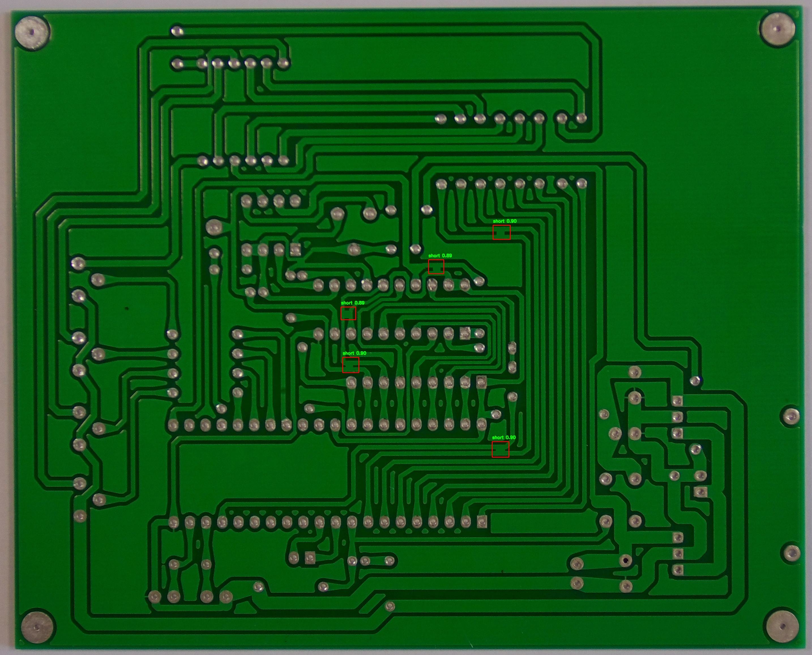

# Automated PCB Defect Inspection System

## Overview
This project implements an **Automated Quality Inspection System** for **Printed Circuit Boards (PCBs)** using **YOLOv5 and PyTorch**.  
It detects, classifies, and localizes PCB defects, providing **confidence scores, defect coordinates**, and **severity analysis**.  

The system generates:
- Annotated images with bounding boxes
- CSV report of defects
- Severity graphs

## Key Features
- Detects multiple PCB defects: missing holes, short circuits, scratches, mouse bites  
- Classifies defects with confidence scores  
- Outputs defect center coordinates `(x, y)`  
- Computes defect severity (normalized bounding box area)  
- Generates CSV report and severity bar chart  

## Tech Stack
- Python 3.12  
- PyTorch 2.9.1  
- YOLOv5 
- OpenCV, Pandas, Matplotlib  

## Quick Setup

bash
# Create virtual environment
python3 -m venv venv

# Activate (Linux/Mac)
source venv/bin/activate
# Activate (Windows)
venv\Scripts\activate

# Install dependencies
pip install --upgrade pip
pip install torch torchvision opencv-python pandas matplotlib

Run Script

Set your model weights path in pcb_inspection_baseline.py:

WEIGHTS = "/path/to/runs/weights/baseline.pt"

Run the inspection:

python pcb_inspection_baseline.py

Outputs will be saved in sample_outputs/:

Annotated images (*.jpg)

defect_analysis.csv containing defect type, confidence, center coordinates, and severity

severity_graph.png visualizing average severity per defect type
Input Images 
 
Sample Outputs
Annotated PCB Images
 
and many more in the folder You can check it 
Severity Graph

CSV Data Example
image	defect_type	confidence	center_x	center_y	severity
01_missing_hole_01.jpg	missing_hole	0.92	150	230	0.05
06_short_06.jpg	short	0.88	310	120	0.08
11_mouse_bite_03.jpg	mouse_bite	0.95	250	200	0.07

 Folder Struture

  # Main Program Location is in  Scripts/perfect.py // program to run 

PCB_Defect_Inspection/
│
├─ dataset/images/           # PCB input images (defective & defect-free)
├─ runs/weights/             # baseline.pt model
├─ sample_outputs/           # Annotated images, CSV, and graphs
├─ pcb_inspection_baseline.py
├─ defect_analysis.csv
└─ README.md

Challenges & Solutions
Problem	Solution
YOLO model not found	Used absolute path to weights file
Slow CPU inference	Optional GPU support / batch processing
Defining severity	Computed normalized bounding box area
Multiple outputs	Integrated CSV export and Matplotlib graphs

Future Enhancements

Confidence threshold filtering

Real-time PCB inspection with cameras

Color-coded bounding boxes per defect type

Advanced defect prioritization metrics

Link of The video demo 
Here :-
https://drive.google.com/file/d/16YuD5963cQ60LJbAYh3ttZVEb9CnSUX_/view?usp=drive_link